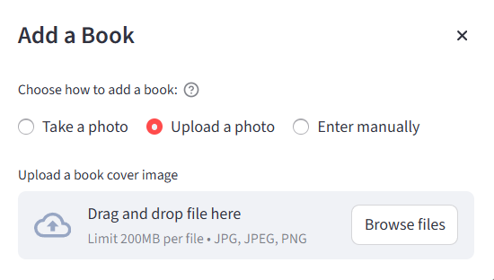

# Personal Library Project

A simple project to manage and organize your personal book collection.

## Features

- Add, edit, and remove books

- Search and filter books

- Edit and delete books

## Getting Started

1. Clone the repository.
2. Install dependencies.
3. Run the application.

## License

MIT