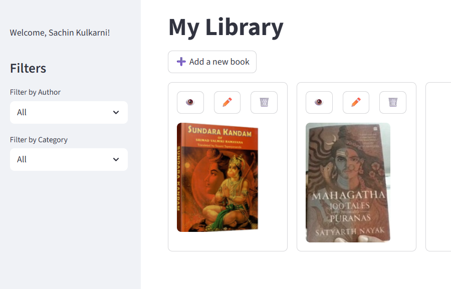
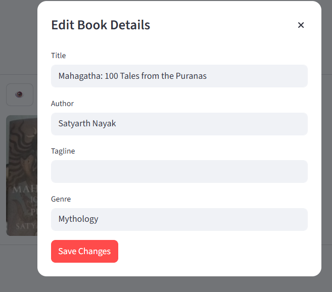

# Personal Library Project

The My Library Project is a user-friendly application designed to help you catalog, manage, and track your book collection. With intuitive features for searching, filtering, and editing book entries, you can easily organize your library. The app supports adding books by scanning covers, uploading images, or entering details manually, making it flexible for various use cases. Whether you're a casual reader or an avid collector, this project streamlines the process of maintaining your personal library.

 **Authentication** The application supports Google login for secure and convenient authentication. You can sign in with your Google account to access the application.

**LLM** The application leverages Large Language Models (LLMs) to help identify books from their covers, providing accurate suggestions and streamlining the cataloging process.

## Features

- Search and filter books

- Add a book by taking a picture, uploading an image or adding details manually

- Edit books

## Getting Started

1. Clone the repository.
2. Install dependencies.
3. Run the application.

## License

MIT