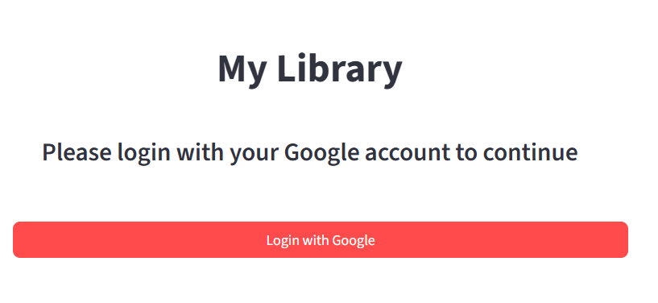
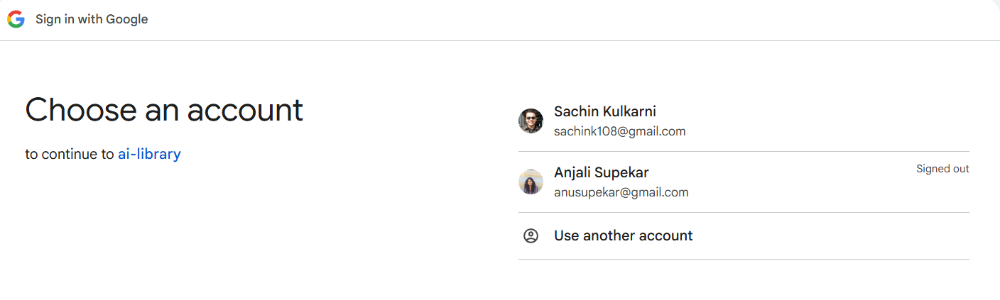
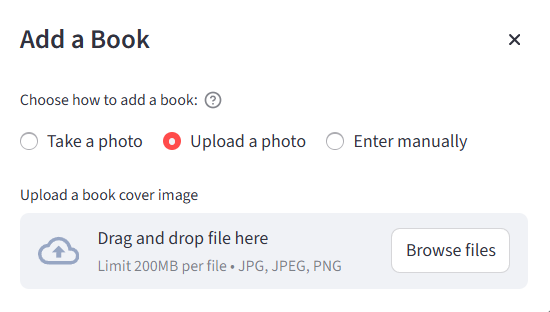
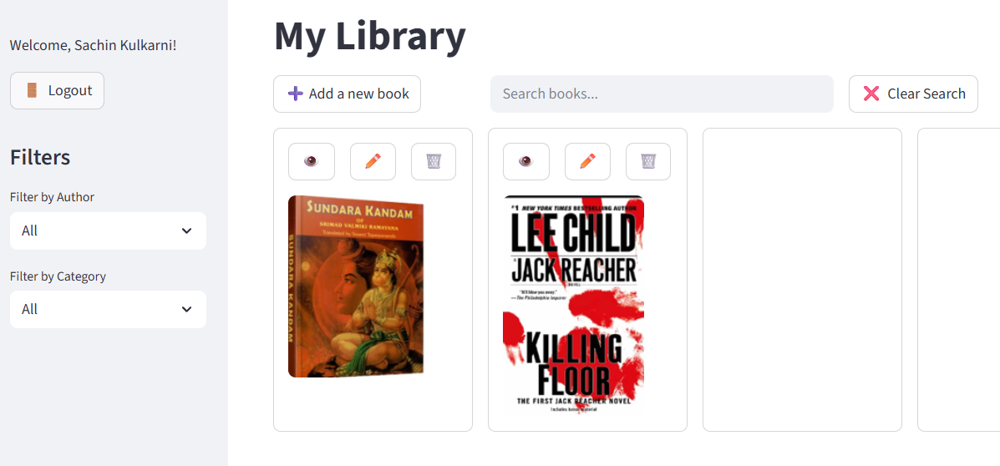
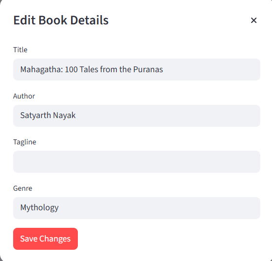

# 📚 My Personal Library App

Welcome to **My Library** – your smart, AI-powered book catalog for readers, collectors, and lifelong learners!  
Effortlessly organize, search, and manage your book collection with a beautiful interface and powerful features.

---

## ✨ Why You'll Love My Library

- **Secure Google Login:**  
  Sign in with your Google account for a personalized and safe experience.
  
   
   

- **Instant Book Recognition and Flexible Entry:**  
  Snap a photo, upload an image, or type in details – you choose!  
  

- **Smart Search & Filters:**  
  Quickly find and filter books by author, genre.  
  

- **Easy Editing:**  
  Update book info, change covers, or add notes anytime.  
  

---

## 🚀 Getting Started

1. **Clone the repository:**  
   `git clone https://github.com/yourusername/agentic-library.git`
2. **Install dependencies:**  
   `pip install -r requirements.txt`
3. **Run the app:**  
   `streamlit run agentic_library/main.py`

---

## 🛡️ License

MIT – Free for personal and commercial use.

---

## 🤖 Powered By

- **Streamlit** for a beautiful UI
- **OpenAI LLMs** for book cover recognition
- **Google OAuth** for secure authentication

---

> **Ready to rediscover your bookshelf? Start organizing with My Library today!**